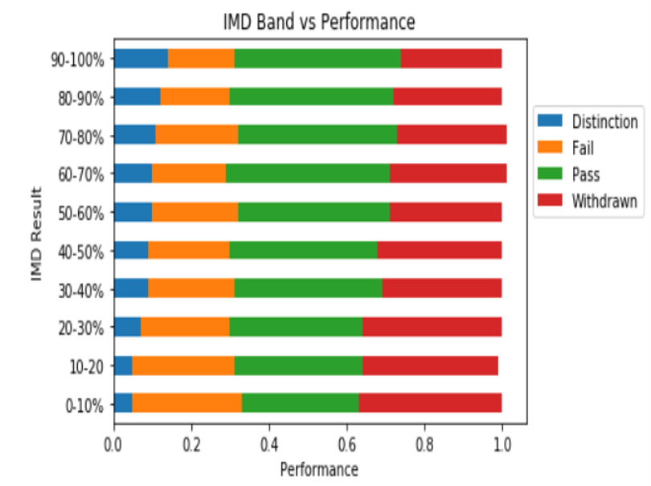

# Student-recommender-system :blue_book:
# Introduction 
  With online classes teachers have a hard time evaluating and understanding their students and focus on students who need attention and direction
  Hence there can be ways to automate the process of assessing previous exam performance and predict if a student will drop the course or needs special attention or not. 

# Problem Statement
  To steer the learning process and provide valuable insight and recommendation for both teachers and students while discovering the optimal student- centric paths and improving their learning environment.
  Users must be able to input the class performance data and they should get insights and recommendations on how to improve class performance
# Objective
  
   * Feed in every student’s performance and train module to analyse the data.
   * Get predictions on how the students will perform in upcoming tests.
   * Can predict if students will drop the course(if the fail/low performance) also help faculty to focus on weak students.

# Proposed work 
  * The Predictive and Recommendation part of the project is the only module that remains to be fully implemented.
  * Currently the many methods to build initial models are being explored and based on their accuracies and the needs of the module, the  best  model will be implemented.

# Application and future scope
  * Using proposed work , we can use the system in the college to automate particular tasks such as making performance index of students, pass/fail prediction etc.
  * The user just needs to give data in the specified format and then the module automatically clean, and visualize existing data to provide insights the particular class’ performance.
  * The module will then be able to build a test module and then give out the required recommendations from said module.

# Process and Methodology
  

# Results
* Relatiopn Between performance of the students to their gender.

* Age vs Result

* Higher education vs Perfromance

* IMD band vs performance
  
    

